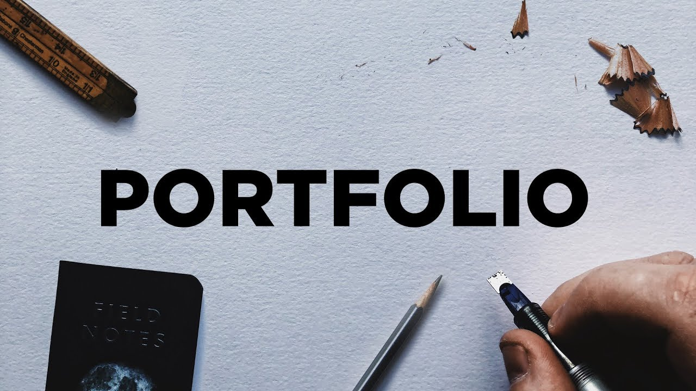

# ThrishulOS v2.0 | Full-Stack Developer Portfolio

Welcome to **ThrishulOS**, a futuristic, interactive desktop operating system experience built with Vanilla JavaScript, HTML5, and CSS3. This portfolio is designed to showcase my skills, projects, and achievements through a unique "OS-in-browser" interface.

## 🚀 New in v2.0
- **Interactive Terminal**: Fully functional terminal emulator supporting 15+ commands (`help`, `neofetch`, `projects`, etc.).
- **System Monitor**: Real-time mock tracking of CPU, RAM, and Disk usage for an immersive experience.
- **Glassmorphism UI**: Premium window management system with drag-and-drop, minimize, and maximize functionality.
- **Functional Contact Form**: Integrated with **EmailJS** for direct inbox delivery with success/error notifications.
- **Notepad App**: Built-in text editor with `localStorage` persistence for quick notes.
- **Achievements & Education**: Dedicated windows for tracking academic milestones and hackathon wins.
- **Dynamic Background**: Floating particle system that connects on proximity.
- **Dark/Light Theme**: Seamless theme toggling with persistent user preference.
- **Visitor Counter**: Real-time visit tracking displayed in the system tray.

## 💻 Tech Stack
- **Frontend**: HTML5, CSS3 (Vanilla), JavaScript (ES6+)
- **Integration**: EmailJS (Communication), FontAwesome (Icons), Devicons (Skills)
- **Animations**: CSS Keyframes + Canvas API (Particles)

## 📸 Preview


## 🛠️ Run Locally
Clone the project and open `index.html` in your browser:

```bash
git clone https://github.com/crazylogic03/My_Portfolio.git
cd My_Portfolio
open index.html
```

## 📬 Contact
Reach out at: **thrishul.professional@gmail.com** or connect with me via [LinkedIn](https://linkedin.com/in/sai-thrishul-3a4077329) / [GitHub](https://github.com/crazylogic03).
